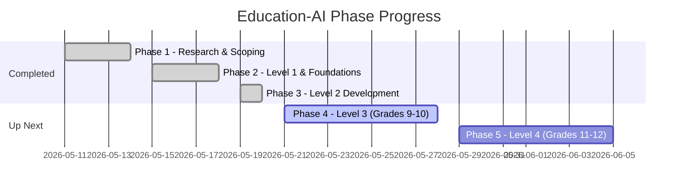

# 📊 Project Progress & Engineering Report: Education-AI (AuraEdu)
**Date:** May 21, 2026  
**Status:** Phases 1–3 Complete (Level 1 & Level 2 Active)  
**Total Development Progress:** ~65%  
**Lead Engineer:** Yash shelke   
**Framework:** React 19, Vite, Tailwind CSS v4, Supabase, Framer Motion

---

## 🎯 Executive Summary
Education-AI (AuraEdu) is a premium, high-fidelity learning web application designed for students from **Grade 1 to 12**. The platform splits features, visuals, and tools into tailored brackets called **Levels** (Level 1 to Level 4) to ensure developmental alignment. 

To date, the **core system foundations**, **Level 1 (Explorers: Grades 1-4)**, and **Level 2 (Focus & Habit: Grades 5-8)** are **100% complete, fully implemented, and integrated** with our backend database. We are prepared to transition into **Phase 4 / Level 3 (Strategic Preparation: Grades 9-10)**.

---

## 🛠️ Completed Phases & Technical Implementation

### 1. Phase 1: Foundation (100% Complete)
*   **Aesthetic Core Setup:** Created global variables and token systems (CSS variables in `Variables.css`). Configured custom palettes, unified responsive wrappers, and dynamic, high-performance visual elements.
*   **Routing System:** Built the base path framework using `react-router-dom` in `App.jsx`, registering explicit landing nodes, dashboard interfaces, and interactive activity centers.
*   **Auth-Decoupled Data Bridge:** Initialized the Supabase connection module. To maximize privacy and flexibility, implemented a **UUID-based decoupled profile mapping** (storing profiles via local storage identifiers backed up to cloud tables).

---

### 2. Phase 2: Level 1 — Explorers: Grade 1–4 (100% Complete)
Focused on cognitive engagement, tactile tracing, and game-inspired counting.

*   **Alphabet Writing (Canvas Tracing Engine):**
    *   *SVG Skeleton paths:* Developed structured letters mapping inside `letterPaths.js`.
    *   *Accuracy Scoring Engine:* Analyzes student canvas inputs against target shapes, utilizing a calculated 70% coverage and 30% precision algorithm.
    *   *Boundary Mask:* Restricts brush movements using an off-screen pre-rendered canvas layer.
*   **Living Math (Tactile Arithmetic):**
    *   Implemented drag-and-drop emoji-based counting modules. Triggers real-time gamification logs upon successful equations.
*   **Student Onboarding Flow:**
    *   An onboarding wizard that collects student nicknames and lets them select glassmorphic avatar cards.
*   **Ecosystem Guardrails (High Engineering Standards):**
    *   **No-Scroll Rule:** Implemented locked viewport constraints (`width: 100vw; height: 100dvh; overflow: hidden`) with calculated flex budgets (`flex-shrink-0` on headers, `flex-1 min-h-0` on content grids).
    *   **Performance Optimization:** Migrated heavy loops to pure hardware-accelerated CSS animations (`pulseSlow`, `floatBob`) rather than Javascript loops. Throttled draw-listeners to fire every 8 coordinate inputs.
    *   **ASCII-Safe Emojis:** Converted all raw JSX emojis into explicit Unicode escapes (e.g., `'\u{1F31F}'`). This mitigates potential UTF-8 compilation corruption across shell sync routines.

---

### 3. Phase 3: Level 2 — Focus & Habit: Grade 5–8 (100% Complete)
Focused on self-regulation, structured note-taking, and AI academic assistance.

*   **Daily Streak Calendar:**
    *   Constructed a dynamic calendar that parses the `active_dates` string array returned from Supabase, rendering live, interactive checkmarks for habit reinforcement.
*   **NoteSelection Highlight Engine:**
    *   Implemented a floating capture utility (`useNoteSelection.js`). Displays a sleek, blur-morphic context actions panel when text is selected inside learning content, allowing instant captures.
*   **Cloud-Synchronized Notebook:**
    *   Build a responsive Notebook Drawer that interfaces directly with the `notebook_notes` table. Allows students to view, add, inline-edit, and delete notes with real-time cloud synchronization.
*   **StudyChatbot Component Refactoring:**
    *   Refactored the conversational assistant into modular, specialized components (`ChatHeader`, `MessageItem`, `ChatInputForm`, `ActiveSourcesIndicator`, and `Notes`) for maximum load speeds, cleaner files, and maintainability.

---

## 🗄️ Database Schema & Supabase Architecture

The application implements a robust, secure PostgreSQL schema with complete Row Level Security (RLS) policies allowing for public insertion/updates (ideal for auth-decoupled student usage while retaining session integrity via UUID keys).

### 1. Custom Postgres Enums
*   **`grade_group_type`**: `'1-4'`, `'5-8'`, `'9-10'`, `'11-12'` (dictates level features and rules)
*   **`chat_sender_type`**: `'user'`, `'ai'` (identifies message origin in conversational modules)

### 2. Relational Database Tables

| Table Name | Column | Data Type | Constraints & Keys | Description |
| :--- | :--- | :--- | :--- | :--- |
| **`profiles`** | `id` | `UUID` | `PRIMARY KEY` (Ref `auth.users(id)`) | Main student identity, auth-decoupled mapping |
| | `full_name` | `TEXT` | | Nickname or full name |
| | `grade_group` | `grade_group_type` | `NOT NULL` | Targets the experience (Level 1 to 4) |
| | `avatar_url` | `TEXT` | | Selected student avatar asset path |
| | `created_at` | `TIMESTAMPTZ` | `DEFAULT NOW()` | Record registration date |
| **`documents`** | `id` | `UUID` | `PRIMARY KEY`, `DEFAULT gen_random_uuid()` | Standard references or study text records |
| | `title` | `TEXT` | `NOT NULL` | Material title |
| | `description`| `TEXT` | | Context of the document |
| | `file_url` | `TEXT` | | Direct link to storage bucket asset |
| | `created_at` | `TIMESTAMPTZ` | `DEFAULT NOW()` | Upload date |
| **`user_streaks`**| `user_id` | `UUID` | `PRIMARY KEY` (Ref `profiles(id)`) | Track daily habit streaks |
| | `current_streak` | `INTEGER` | `DEFAULT 0` | Current consecutive active days |
| | `longest_streak` | `INTEGER` | `DEFAULT 0` | All-time peak active days |
| | `last_active_date` | `DATE` | `DEFAULT CURRENT_DATE` | Date of last recorded study activity |
| | `updated_at` | `TIMESTAMPTZ` | `DEFAULT NOW()` | Last update timestamp |
| **`badges`** | `id` | `UUID` | `PRIMARY KEY`, `DEFAULT gen_random_uuid()` | Master list of all reward badges |
| | `title` | `TEXT` | `NOT NULL` | Badge name |
| | `description`| `TEXT` | | Criteria or details of reward |
| | `icon_url` | `TEXT` | | Graphic asset pathway |
| | `grade_group` | `grade_group_type` | | Target audience bracket |
| | `rarity` | `TEXT` | `DEFAULT 'common'` (Check `common`, `rare`, `legendary`) | Reward weight and tier |
| | `created_at` | `TIMESTAMPTZ` | `DEFAULT NOW()` | Badge creation date |
| **`user_badges`** | `id` | `UUID` | `PRIMARY KEY`, `DEFAULT gen_random_uuid()` | Unlocked rewards bridge |
| | `user_id` | `UUID` | `Ref profiles(id) ON DELETE CASCADE` | Student unlocking the badge |
| | `badge_id` | `UUID` | `Ref badges(id) ON DELETE CASCADE` | Unlocked badge identity |
| | `unlocked_at` | `TIMESTAMPTZ` | `DEFAULT NOW()` | Moment of achievement |
| **`notebook_notes`** | `id` | `UUID` | `PRIMARY KEY`, `DEFAULT gen_random_uuid()` | Captured text notes & cloud annotations |
| | `user_id` | `UUID` | `Ref profiles(id) ON DELETE CASCADE` | Note creator |
| | `document_id` | `UUID` | `Ref documents(id) ON DELETE SET NULL` | Reference reading material |
| | `highlighted_text` | `TEXT` | `NOT NULL` | Captured text selection |
| | `user_annotations` | `TEXT` | | Personal study annotations |
| | `created_at` | `TIMESTAMPTZ` | `DEFAULT NOW()` | Note creation time |
| **`concept_maps`**| `id` | `UUID` | `PRIMARY KEY`, `DEFAULT gen_random_uuid()` | Visual React-Flow Mind Maps |
| | `user_id` | `UUID` | `Ref profiles(id) ON DELETE CASCADE` | Map creator |
| | `document_id` | `UUID` | `Ref documents(id) ON DELETE SET NULL` | Reference reading material |
| | `map_data` | `JSONB` | `DEFAULT '{}'::jsonb` | Full React-Flow node layout coordinates |
| | `updated_at` | `TIMESTAMPTZ` | `DEFAULT NOW()` | Last modification time |
| **`activity_logs`**| `id` | `UUID` | `PRIMARY KEY`, `DEFAULT gen_random_uuid()` | Telemetry of student actions and lessons |
| | `user_id` | `UUID` | `Ref profiles(id) ON DELETE CASCADE` | Performer |
| | `activity_type`| `TEXT` | `NOT NULL` (e.g. `alphabet_tracing`) | Category of student action |
| | `score` | `INTEGER` | | Score or accuracy percentage achieved |
| | `metadata` | `JSONB` | `DEFAULT '{}'::jsonb` (e.g. `{ "letter": "A" }`) | Context-specific telemetry variables |
| | `completed_at`| `TIMESTAMPTZ` | `DEFAULT NOW()` | Completion timestamp |
| **`chat_sessions`**| `id` | `UUID` | `PRIMARY KEY`, `DEFAULT gen_random_uuid()` | Conversational helper session tracking |
| | `user_id` | `UUID` | `Ref profiles(id) ON DELETE CASCADE` | Student in session |
| | `document_id` | `UUID` | `Ref documents(id) ON DELETE SET NULL` | Linked study textbook context |
| | `title` | `TEXT` | | Chat thread label |
| | `created_at` | `TIMESTAMPTZ` | `DEFAULT NOW()` | Session opening timestamp |
| **`chat_messages`**| `id` | `UUID` | `PRIMARY KEY`, `DEFAULT gen_random_uuid()` | Single chat exchange records |
| | `session_id` | `UUID` | `Ref chat_sessions(id) ON DELETE CASCADE` | Parent conversation thread |
| | `sender` | `chat_sender_type` | `NOT NULL` | Sender role: `user` or `ai` |
| | `message_content`| `TEXT`| `NOT NULL` | Conversational text exchange content |
| | `citations` | `JSONB` | `DEFAULT '[]'::jsonb` | References matching the RAG textbook data |
| | `created_at` | `TIMESTAMPTZ` | `DEFAULT NOW()` | Message timestamp |

### 3. Row-Level Security (RLS) & Anon Policy Upgrades
*   To enable seamless onboarding without forced logins, we deployed custom SQL patches (`schema_patch.sql`) opening the endpoints to public `anon` and `authenticated` roles with custom policies.
*   **Security Profiles**: Users can select and view any profile records.
*   **Encrypted Scopes**: Direct access to `notebook_notes`, `concept_maps`, and `chat_sessions` utilizes specific user session key filters so students only modify and fetch their own personal work scopes.

---

## 🚀 Up Next: Phase 4 / Level 3 — Strategic Prep (Grades 9-10)
Our technical objectives for the next development sprints are:

1.  **Concept Mapping (React-Flow integration):** 
    Interactive node canvas enabling older students to visually construct subject mind maps (Science, History, Literature) with tree relationships.
2.  **Mock Test Simulator:**
    A testing suite featuring customizable timers, subject-wise marking criteria, and a dashboard summarizing topic performance.
3.  **Pomodoro Focus Timer:**
    An integrated ambient audio focus widget synchronized with the gamification streak tracker to log active deep-work sessions.
4.  **Academic AI RAG Endpoint integration:**
    Connecting the chatbot's sources indicator to live textbook knowledge vectors.
